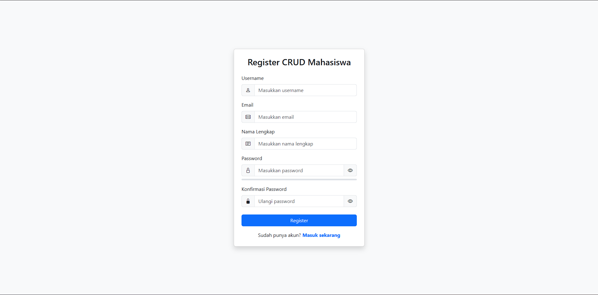
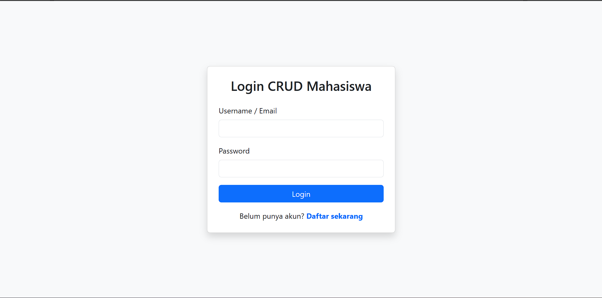
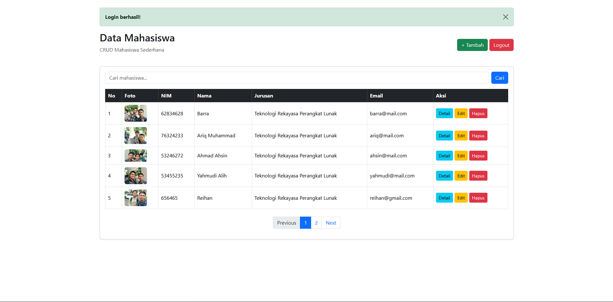
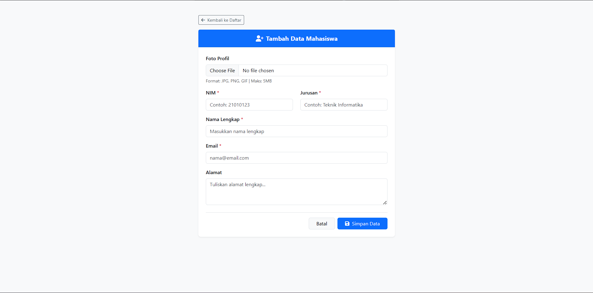
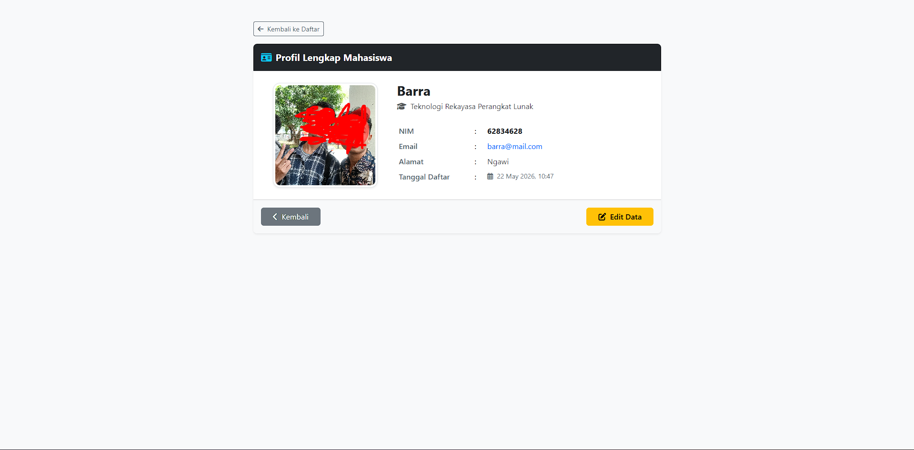
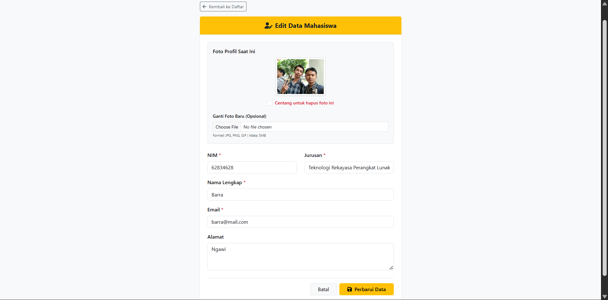

# ppw1-portfolio
# Portfolio Praktikum Pemrograman Web 1 (PPW1)

Repositori ini berisi kumpulan tugas praktikum Pemrograman Web 1 (PPW1) sepanjang Semester 2 di Program Studi Teknologi Rekayasa Perangkat Lunak, Universitas Gadjah Mada.

---

## Identitas Mahasiswa
* **Nama:** Muhammad Rasyid
* **NIM:** 25/566545/SV/27093
* **Prodi:** Teknologi Rekayasa Perangkat Lunak (TRPL)
* **Angkatan:** 2025

---

## Deskripsi Project
Portfolio ini merupakan rekam jejak digital dari hasil pembelajaran praktikum kuliah PPW1. Proyek yang dikerjakan mencakup pengembangan halaman web dari tingkat dasar (*client-side* menggunakan HTML, CSS, JavaScript, dan Bootstrap) hingga pengembangan aplikasi web dinamis yang terintegrasi dengan server dan database menggunakan PHP dan MySQL.

---

## Link Demo Live
Aplikasi web hasil praktikum (fitur CRUD terintegrasi) dapat diakses secara langsung melalui tautan di bawah ini:
[**Kunjungi Live Demo Aplikasi di InfinityFree**](https://ubah-dengan-link-infinityfree-kamu.infinityfreeapp.com)

---

## Tabel Daftar Bab Praktikum

| Bab / Pertemuan | Judul Materi Praktikum | Deskripsi Singkat Tugas | Status |
| :---: | :--- | :--- | :---: |
| **Bab 1** | Kontrak Perkuliahan dan Pengenalan | Pengenalan lingkungan kerja dan tools web development. | Semuanya Selesai |
| **Bab 2** | Dasar-dasar HTML | Pembuatan struktur komponen dasar halaman web. | Semuanya Selesai |
| **Bab 3** | Link Frame dan Table | Navigasi halaman antar-page dan penyajian data tabel. | Semuanya Selesai |
| **Bab 4** | Form dan Gambar | Pembuatan input form interaktif dan pengelolaan aset gambar. | Semuanya Selesai |
| **Bab 5** | Stylesheet | Styling dan pewarnaan elemen HTML menggunakan CSS dasar. | Semuanya Selesai |
| **Bab 6** | Flexbox and Responsiveness | Pembuatan layout web modern yang responsif dengan Flexbox. | Semuanya Selesai |
| **Bab 7** | Stylesheet 2 | Eksplorasi lanjutan kustomisasi layout dan komponen CSS. | Semuanya Selesai |
| **Bab 8** | Bootstrap | Implementasi framework CSS Bootstrap untuk UI responsive. | Semuanya Selesai |
| **Bab 9** | Penerapan Desain Website | Proses slicing desain UI/UX menjadi halaman kode web jadi. | Semuanya Selesai |
| **Bab 10** | JavaScript | Penambahan logika interaktif pada client-side dan DOM. | Semuanya Selesai |
| **Bab 11** | PHP | Sintaks dasar pemrograman server-side menggunakan PHP. | Semuanya Selesai |
| **Bab 12** | CRUD PHP | Koneksi database MySQL dengan operasi Create, Read, Update, Delete. | Semuanya Selesai |
| **Bab 13** | Pelengkap Proyek | Implementasi fitur Searching data, Pagination, dan sistem Login. | Semuanya Selesai |
| **Bab 14** | Deployment (Quizz) | Persiapan, catatan teori, dan dokumentasi kuis deployment. | Semuanya Selesai |

---

## Tangkapan Layar (Screenshot)

### 1. Halaman Pendaftaran (Register)

> *Deskripsi: Halaman registrasi untuk pembuatan akun pengguna baru sebelum dapat mengakses sistem.*

### 2. Halaman Masuk (Login)

> *Deskripsi: Sistem autentikasi pengguna menggunakan session PHP untuk mengamankan hak akses dashboard.*

### 3. Halaman Utama (Dashboard CRUD, Searching & Pagination)

> *Deskripsi: Tampilan utama dashboard yang menyajikan data dari database dalam bentuk tabel, dilengkapi fitur pencarian (searching) dan pembagian halaman (pagination).*

### 4. Halaman Tambah Data

> *Deskripsi: Form input interaktif untuk menambahkan data baru ke dalam database beserta fitur upload file gambar.*

### 5. Halaman Detail Data

> *Deskripsi: Halaman spesifik untuk menampilkan informasi lengkap dan detail dari salah satu data yang dipilih.*

### 6. Halaman Ubah Data (Edit)

> *Deskripsi: Form yang otomatis memuat data lama (populate data) untuk mempermudah pengguna dalam memperbarui informasi di database.*